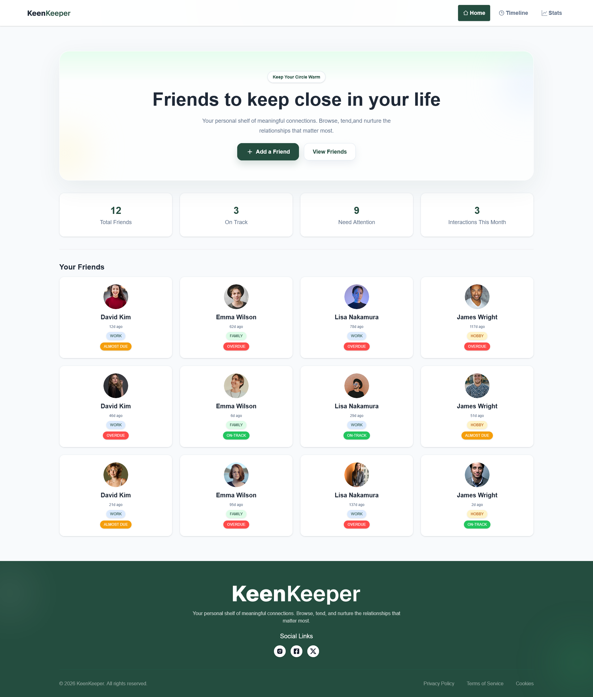
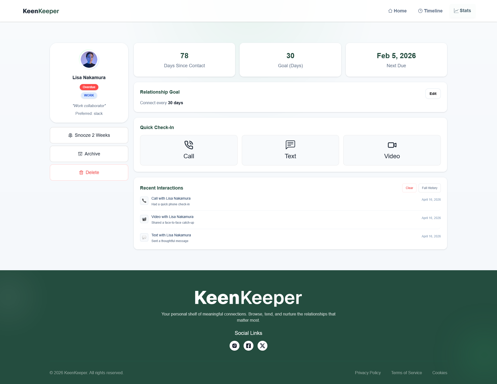
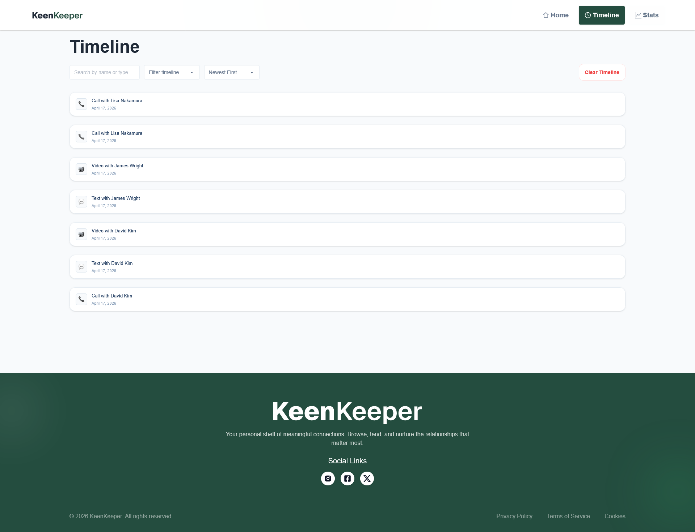
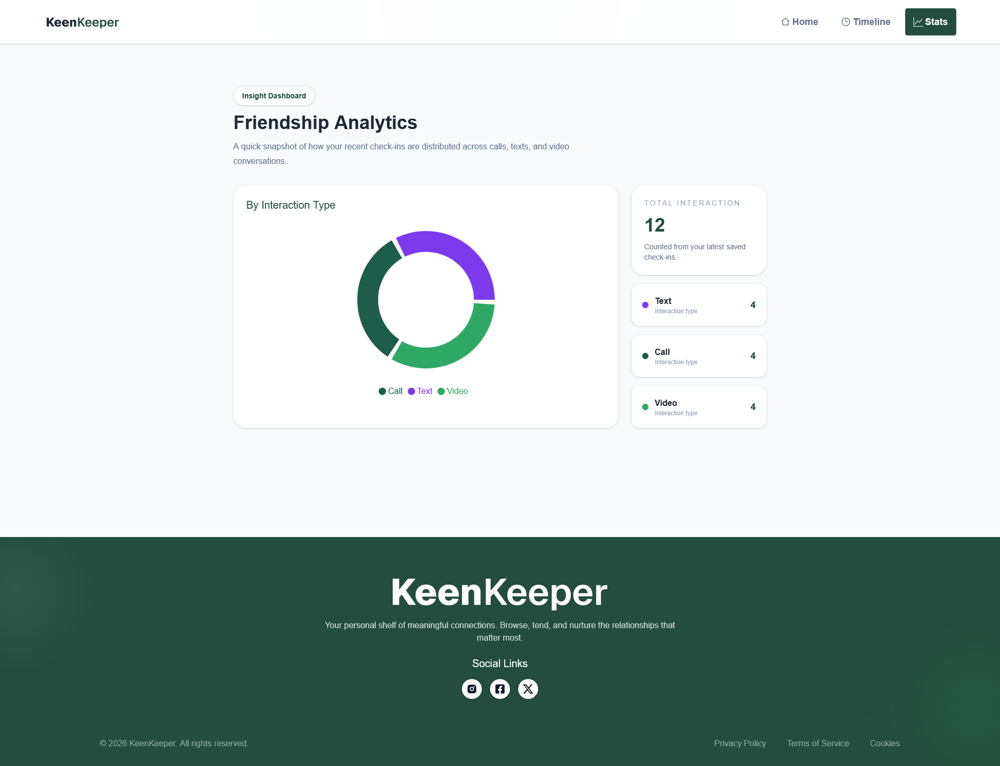

# 📘 KeenKeeper

KeenKeeper is a modern React-based friendship management web application that helps users keep track of meaningful relationships.  
It provides a clean and interactive UI where users can browse friends, view detailed profiles, track recent interactions, and analyze communication habits.

---

## 📸 Preview



---

## 🚀 Live Demo

🔗 Live Website: https://keenkeeper.netlify.app

🔗 GitHub Repository: https://github.com/nafiz2024/Programming-Hero-Assignment-07

---

## ✨ Features

- 👥 Browse and manage friend profiles
- 🔍 View detailed friend information
- 📅 Dynamic days-since-contact calculation
- 📞 Add Call, Text, and Video interactions
- 🕒 View interaction history in Timeline
- 📊 See communication analytics in Stats page
- 💾 Store interactions in localStorage
- ⏳ Auto-delete saved interactions after 24 hours
- 🎨 Clean and interactive UI using Tailwind CSS
- 📱 Fully responsive design
- 🔄 Dynamic data rendering

---

## 🧠 How It Works

1. The app loads friend data from `FriendsData.json`.
2. Friends are displayed in card format on the homepage.
3. Clicking a friend opens the details page.
4. Users can create interactions using Call, Text, and Video buttons.
5. Interactions are stored in context and localStorage.
6. Timeline and Stats update automatically from saved interaction data.
7. Old interactions are removed automatically after 24 hours.

---

## 🛠️ Technologies Used

### Frontend
- React.js
- JavaScript (ES6+)
- Tailwind CSS
- DaisyUI
- React Router
- React Icons
- React Toastify
- Recharts

### Data
- JSON
- localStorage

---

## 📦 Installation

Clone the repository:

```bash
git clone https://github.com/nafiz2024/Programming-Hero-Assignment-07
```

Go to project folder:

```bash
cd Assignment-7
```

Install dependencies:

```bash
npm install
```

Run the project:

```bash
npm run dev
```

Build for production:

```bash
npm run build
```

Run lint:

```bash
npm run lint
```

---

## 📂 Project Structure

```bash
KeenKeeper
│
├── public
│   └── FriendsData.json
│
├── src
│   │
│   ├── assets
│   │
│   ├── Components
│   │   ├── HomePage
│   │   ├── Shared
│   │   └── Ui
│   │
│   ├── Context
│   │   └── Context.jsx
│   │
│   ├── Layout
│   │   └── MainLayout.jsx
│   │
│   ├── Pages
│   │   ├── HomePage
│   │   ├── FriendsDetails
│   │   ├── Timeline
│   │   ├── Stats
│   │   └── ErrorPage
│   │
│   ├── Routes
│   │   └── Routes.jsx
│   │
│   ├── utils
│   │   └── dateUtils.js
│   │
│   ├── main.jsx
│   └── index.css
│
├── package.json
├── vite.config.js
└── README.md
```

---

## 📸 Screenshots

### Home Page


### Friend Details Page



### Timeline Page



### Stats Page



---

## 🔮 Future Improvements

- Add create/edit friend feature
- Add confirm modal before deleting interactions
- Add backend database integration
- Add authentication system
- Add dark mode
- Add more analytics and charts

---

## 👨‍💻 Author

**Nafiz Alam**  
Frontend Web Developer | MERN Stack Developer

- 🌐 GitHub: https://github.com/nafiz2024
- 💼 LinkedIn: https://www.linkedin.com/in/nafiz-alam04/
- 📧 Email: nafizalam.dev@gmail.com

---

## ⭐ Support

If you like this project, give it a star on GitHub ⭐
